# Задачи для собеседований на знание приложения Postman

Здесь представлены задачи для собеседований на знания основ приложения Postman в формате изображений.

## Как использовать?

Предполагается, что кандидату показывают готовый скриншот/слайд/изображение и задают вопрос, связанный с этим слайдом. Например, вопрос "Что выведет этот запрос, представленный на картинке?". Кандидат должен изучить представленный слайд и дать ответ на вопрос.

## Список задач для собеседования

### 🔴🟡🟢 Задача #1 🟢🟡🔴
*Картинка с яркой цветовой гаммой:*

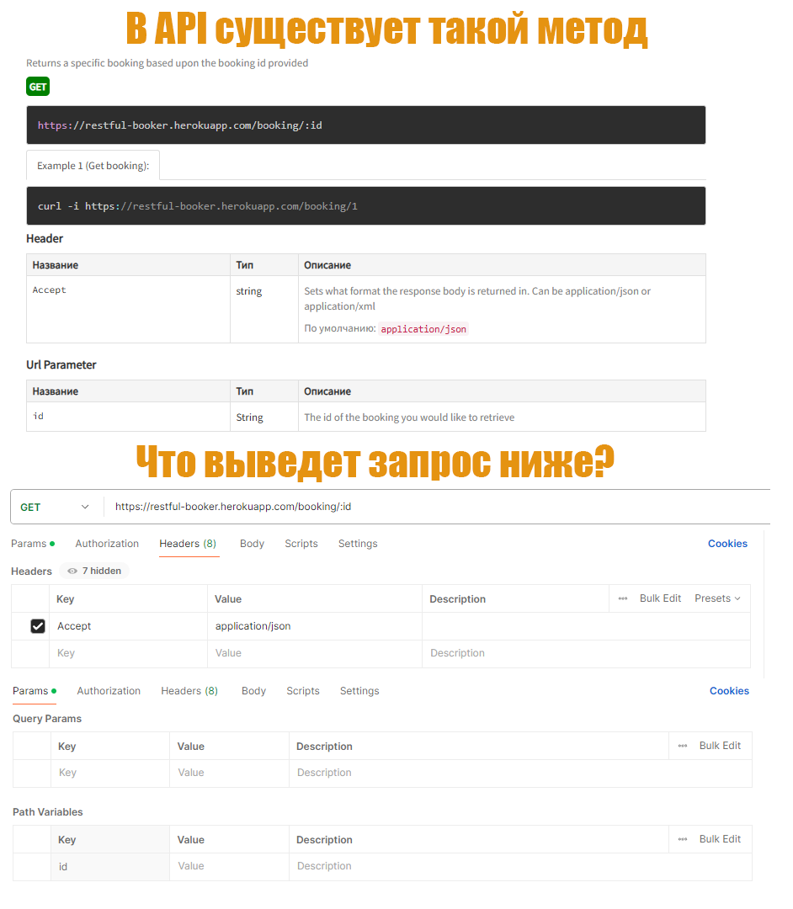<br>

*Картинка с нейтральной цветовой гаммой:*

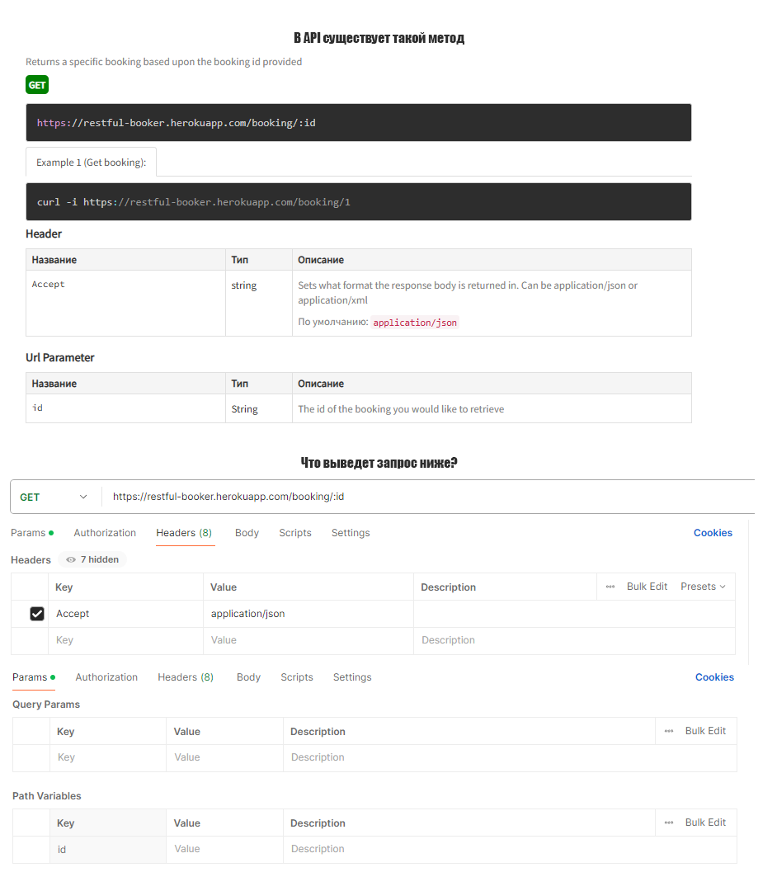

:question: ***Вопрос:*** **Что выведет этот запрос (нижняя часть изображения)?**

:white_check_mark: **Ответ:** При выполнении запроса нам вернется 404 статус-код. Мы отправляем вот такой GET-запрос из Postman https://restful-booker.herokuapp.com/booking/:id, в котором предполагается, что мы будем использовать параметр *:id*, но на картинке видно, что значение параметра не задано! Соответственно запрос отправится именно так в чистом виде (вместо :id никакого значения не подставится) и, естественно, нам вернется 404.

Чисто теоретически, сам Postman мог бы нас предупредить, что значение параметра :id не задано, но он этого не делает, а просто пуляет запрос на сервер в чистом виде.

-----

### 🔴🟡🟢 Задача #2 🟢🟡🔴
*Картинка с яркой цветовой гаммой:*

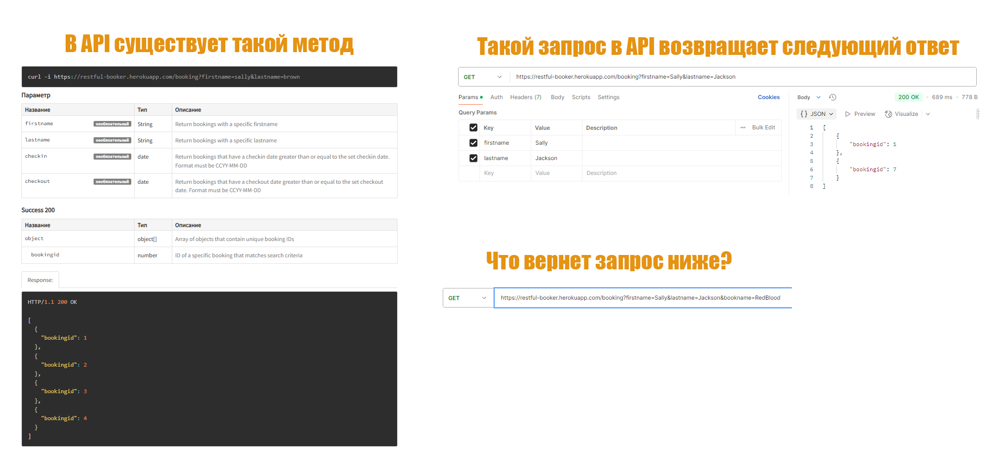<br>

*Картинка с нейтральной цветовой гаммой:*

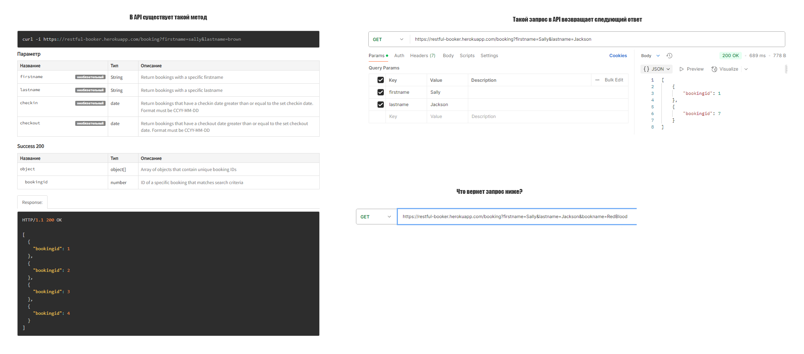

:question: ***Вопрос:*** **Что вернет запрос ?**

:white_check_mark: ***Ответ:*** Запрос вернет ровно тоже самое, что и на скриншоте справа, то есть вот это.

```json
[
	{
		"bookingid": 1
	},
	{
		"bookingid": 7
	}
]
```

Дело в том, что в запросе добавлен параметр *bookname=RedBlood*, но в спецификации такой параметр не описан.

Тут, кстати, можно развить тему. Например, бэкендеры могли написать код так, что входящий запрос будет валидироваться на json-схему (на лишние поля в запросе, в том числе) и в случае несовпадения со схемой, возвращать клиенту какую-нибудь ошибку. Если кандидат про это скажет, то по-моему будет очень неплохо.

-----

### 🔴🟡🟢 Задача #3 🟢🟡🔴
*Картинка с яркой цветовой гаммой:*

<br>

*Картинка с нейтральной цветовой гаммой:*

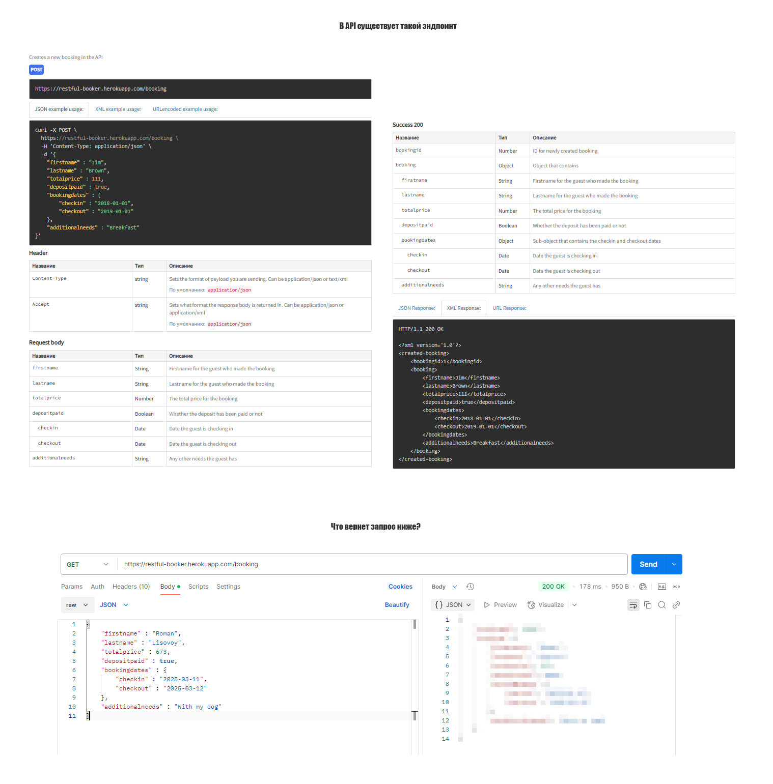

:question: ***Вопрос:*** **Что вернет запрос ?**

:white_check_mark: ***Ответ:*** Здесь картинка сделана специально с подвохом. Если коротко, то запрос про который мы спрашиваем, вернет статус-код 200 и список всех бронирований. Дело в том, что вместо нужного метода POST мы отправляем на сервер GET. А тело отправляемого запроса специально сделано не пустым, для запутывания мозговых нейрончиков.


-----

### 🔴🟡🟢 Задача #4 🟢🟡🔴
*Картинка с яркой цветовой гаммой:*

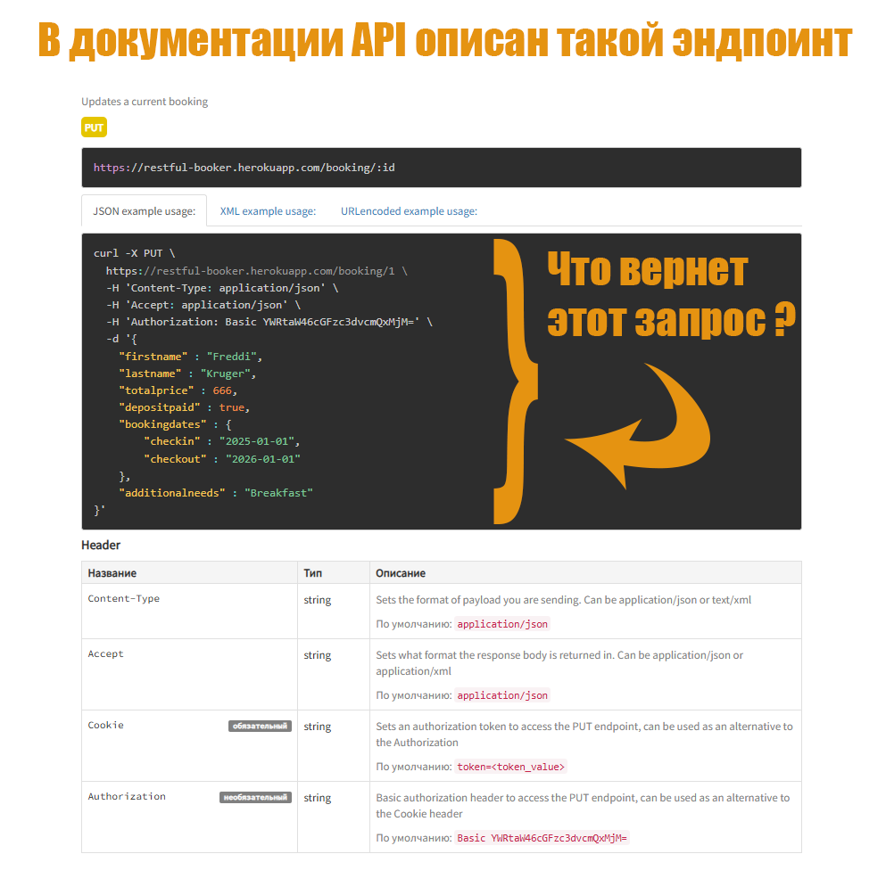<br>

*Картинка с нейтральной цветовой гаммой:*

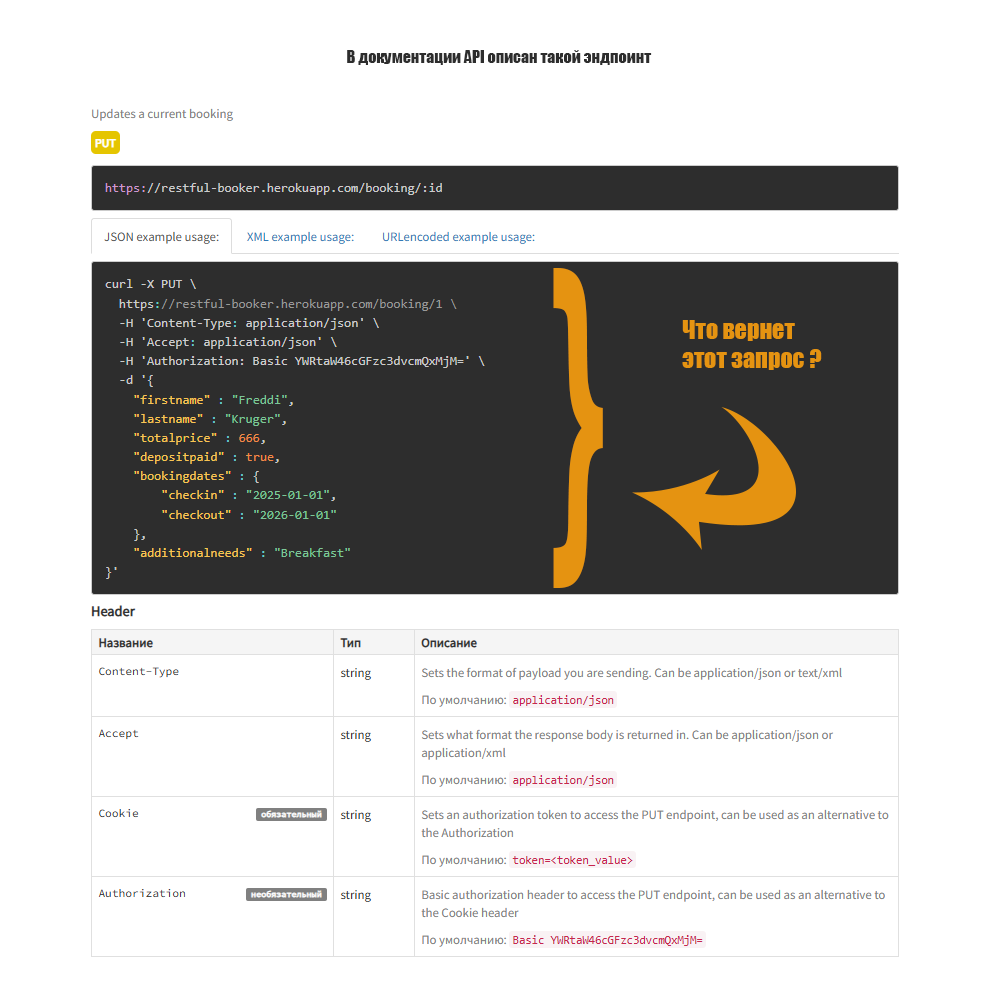

:question: ***Вопрос:*** **Что вернет запрос ?**

:white_check_mark: ***Ответ:*** Если внимательно посмотреть на картинку с заданием, то увидими, что хедер *Cookie* является обязательным, а мы его в заголовках этого запроса не передаем. Соответственно, сервер должен нам вернуть 401 статус-код (или даже 403, смотря что накодили разработчкики).


-----

### 🔴🟡🟢 Задача #5 🟢🟡🔴
*Картинка с яркой цветовой гаммой:*

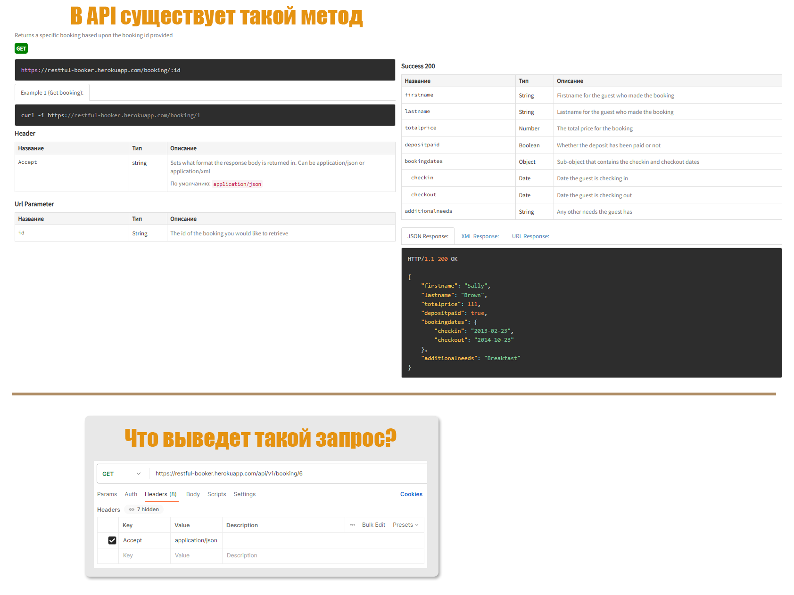<br>

*Картинка с нейтральной цветовой гаммой:*

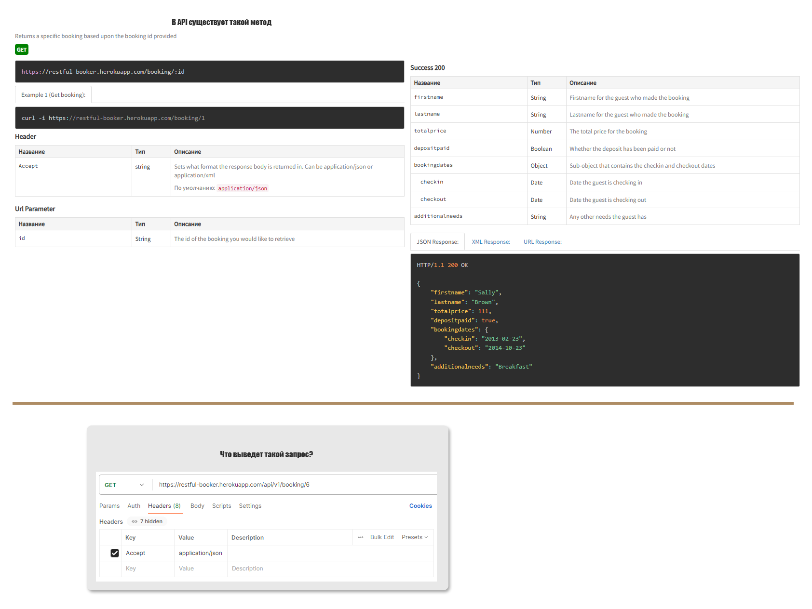

:question: ***Вопрос:*** **Что вернет запрос ?**

:white_check_mark: ***Ответ:*** В ответ на наш запрос, сервер вернет 404. В запросе некорректно указан URL.


-----

### 🔴🟡🟢 Задача #6 🟢🟡🔴
*Картинка с яркой цветовой гаммой:*

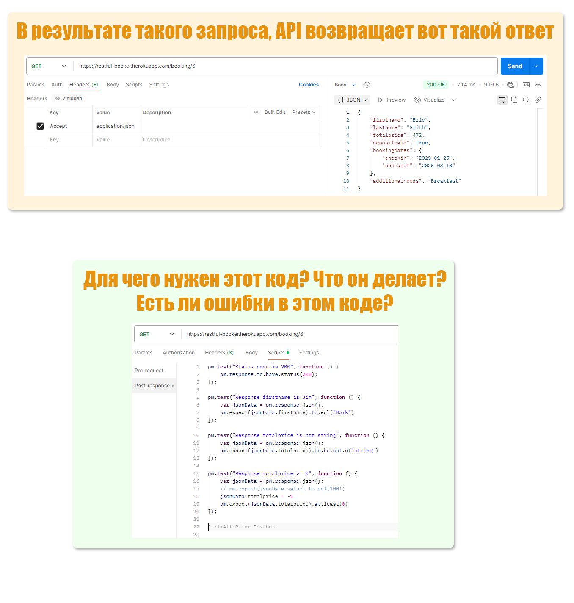<br>

*Картинка с нейтральной цветовой гаммой:*

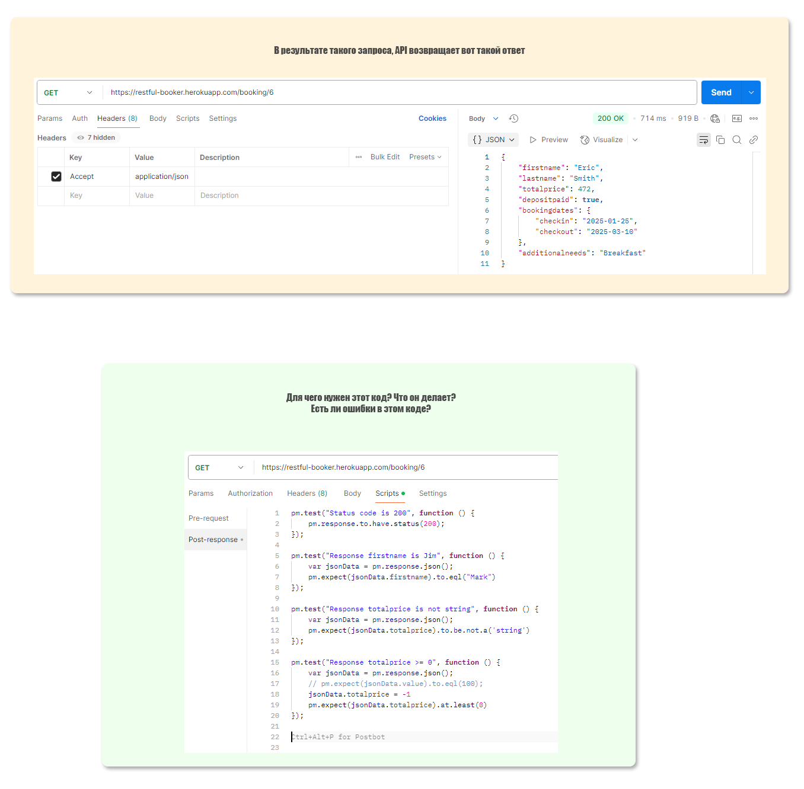

:question: ***Вопрос:*** **Что вернет запрос ?**

:white_check_mark: ***Ответ:*** Этот код на JavsScript на вкладке *"Scripts -> Post-response"* выполнится в Postman после того, как сервер обработает запрос и вернет нам ответ. Этот код выполняет автоматические тесты над полученным ответом. В данном примере один тест - одна функция.

Первый тест (сверху вниз) проверит, что в ответ нам вернулся статус-код 200. Если это действительно так, что тест будет PASS, если же нам вернется что угодно, но не 200, то тест будет FAIL.

Второй тест проверит, что в вернувшемся нам json-ответе поле firstname имеет значение "Mark". Если это так, то тест будет PASS. Если вернется имя не "Mark", то тест будет FAIL.

Третий тест проверяет, что в ответе в поле totalprice хранится что угодно, но только НЕ тип "строка" (strings). Если же вернется это поле с типом strings, то тест будет провален.

Четвертый тест проверяет поле totalprice на то, чтобы оно было больше или равно 0. Если поле totalprice нам придет с отрицательным значением, то тест будет провален (FAIL).

Ошибка в этом коде есть только в четвертом тесте - там мы специально переназначем поле totalprice в -1. То есть, независимо от того, что нам вернулось в ответе от сервера, это поле всегда будет иметь значение -1. И, соответственно, всегда этот тест будет FAIL.


-----

### 🔴🟡🟢 Задача #7 🟢🟡🔴
*Картинка с яркой цветовой гаммой:*

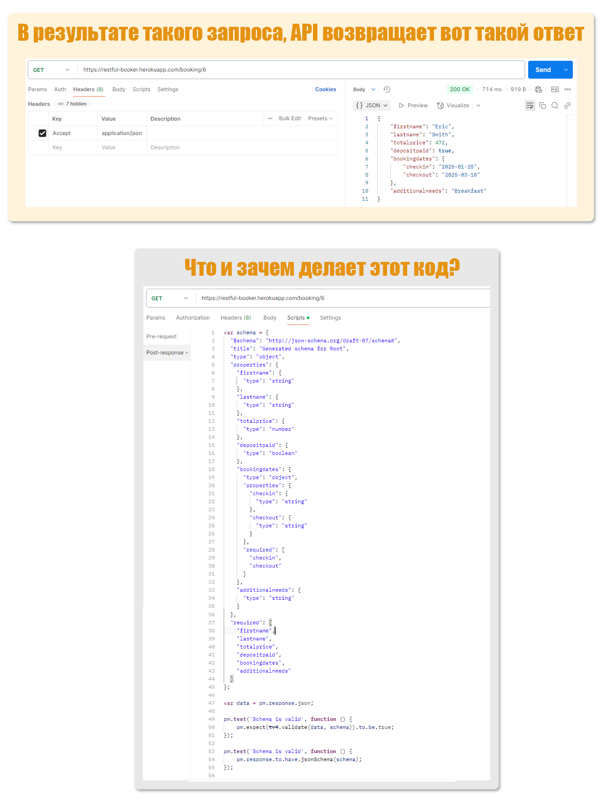<br>

*Картинка с нейтральной цветовой гаммой:*

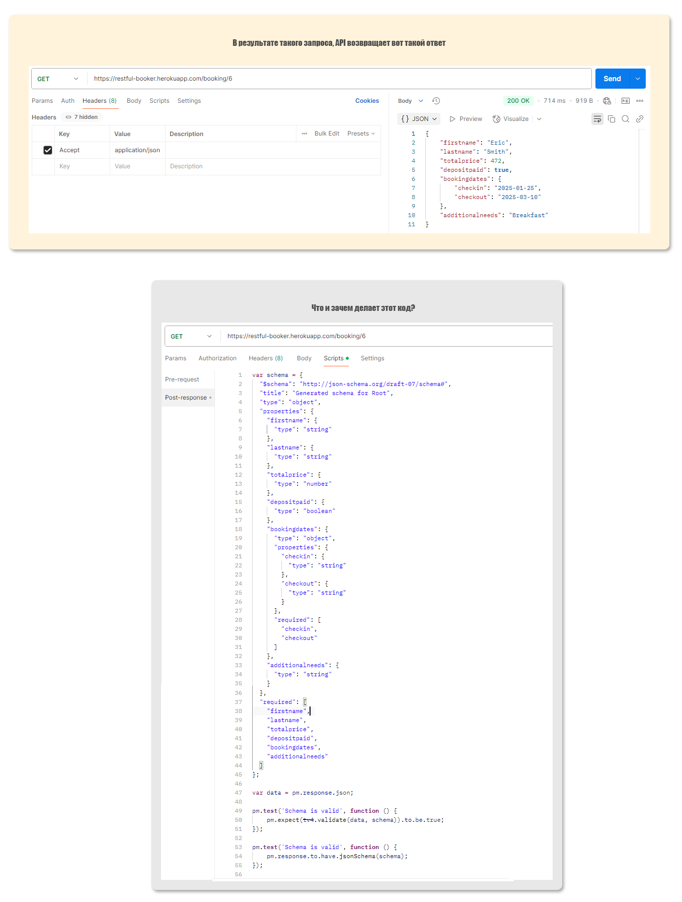

:question: ***Вопрос:*** **Что вернет запрос ?**

:white_check_mark: ***Ответ:*** Этот код на JavsScript на вкладке *"Scripts -> Post-response"* выполнится в Postman после того, как сервер обработает запрос и вернет нам ответ. Этот код выполняет автоматические тесты над полученным ответом.

Конкретно данный код валидирует пришедший нам в ответ JSON на соответствие JSON-схеме, которая здесь же и описана. Просто это сравнение происходит здесь два раза - просто используются две разные библиотеки для сравнения, а результат будет одинаковый.

В данном конкретном примере оба теста будут выполнены успешно - здесь ответ от сервера полностью соответствует json-схеме.

-----

## Описание изображений и исходники изображений

В этом репозитории есть следующие папки, содержащие картинки с заданиями:
- *images_v1_color*  - Здесь лежат наиболее цветастые слайды с заданиями
- *images_v2_bw*     - Здесь лежат уже менее цветастые слайды с заданиями

Имена всех файлов с картинками заканчиваются либо на _v1, либо на _v2. Это одинаковые файлы в плане содержания условий задачи, но немного разные по дизайну (раскидал их для удобства по разным папкам, как указано в абзаце выше). Но по содержанию эти слайды полностью идентичны!

Внутри этих папок с картинками, есть еще подпапки с именем psd - в них лежат исходники изображений в формате PSD. Может пригодиться для создания новых заданий.
